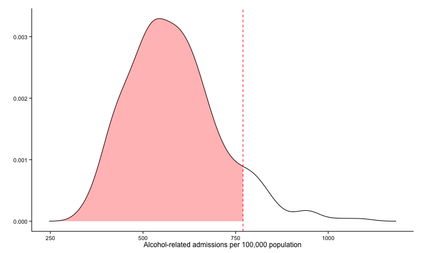

## Available is not the same as accessible

* In the past few years there has been a push to make government data open and available on the web. Following the US lead, the UK Government created data.gov.uk. There is now a wealth of data relevant to public policy available there.

* But just because the data is on the web, doesn't make it accessible to the public. Most people don't spend a lot of time poking around dry spreadsheets on government websites. There is a need for simple, engaging visualisations of this data to draw attention to it and to make it more meaningful for the public.

* As a proof-of-concept, I have chosen to look at alcohol-related hospital admissions. Misuse of alcohol creates a big burden on the health care system in the UK and elsewhere. Alcohol misuse accounted for over 21,000 deaths in the UK in 2012. It is linked to heart disease, stroke, liver disease and cancer. Alcohol is involved in around half of violent crime and contributes to a significant proportion of accident and emergency admissions.

* Better visualisations of this impact might help to focus attention on the problem.

--- .class #id 

## Project outline

There is some evidence that showing people how they compare to their neighbours can improve behaviours like energy use. The aim here is to do the same thing at the local authority level, nudging those with the biggest problem to do something about it.

Alcohol health data is taken from [www.data.gov.uk](http://www.data.gov.uk). This data is *not* tidy. I've written some code to download it and tidy it up.

A density plot shows the distribution of alcohol-related hospital admissions. A vertical line shows where a given local authority is and the shaded the area shows how many local authorities had lower (i.e. better) alcohol-related hospital admissions per 100,000 residents. The next slide shows what this looks like.

Finally, I've turned this into a Shiny app. The app allows the user to select which area and gender they'd like to view data for using two input widgets. The app then shows where that local authority sits in the distribution of local authorities. It also calculates what percentage of local authorities had better statistics.

--- .class #id

## Example: Barnsley

The plot below illustrates the graphical output from app for the local authority area where I grew up for both male and female sexes. Yeah, we like a drink.

 

--- .class #id

## So who cares?

Some examples of people who could be interested in this sort of data include:

1. Local politicians, local government officials
2. Local public health practitioners and health providers
3. People looking to move to a new area
4. Concerned residents!

## So what next?

I plan to keep building interactive visualisations of open government data. This will build up a library of apps that users could browse by category. Hopefully this will go a small way to making this data more accessible.

Thanks for reading!

[Link to the app on shinyapps.io](https://stevenlsenior.shinyapps.io/Data_Products/)

